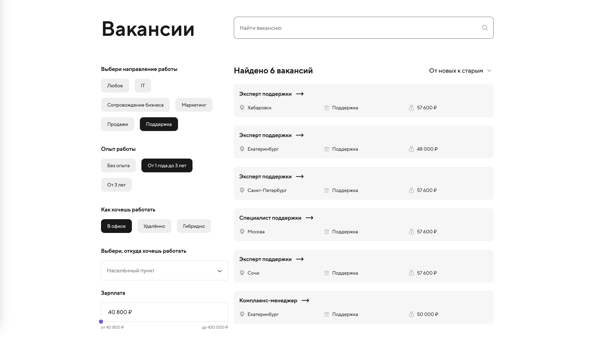
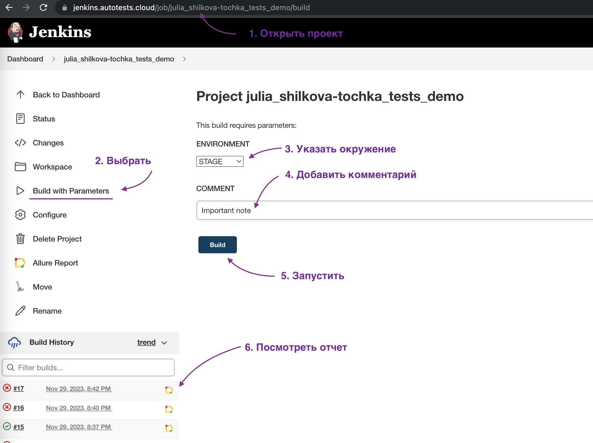
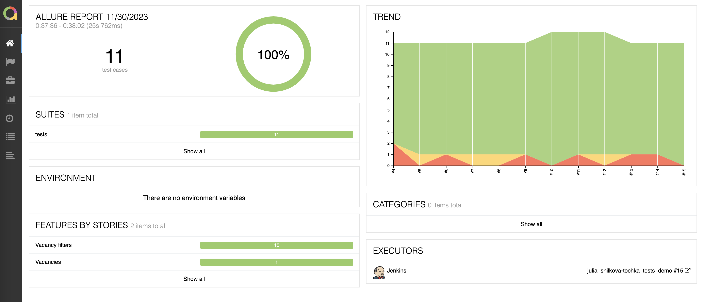
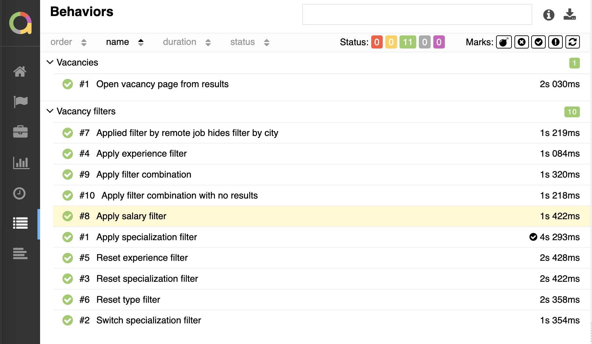
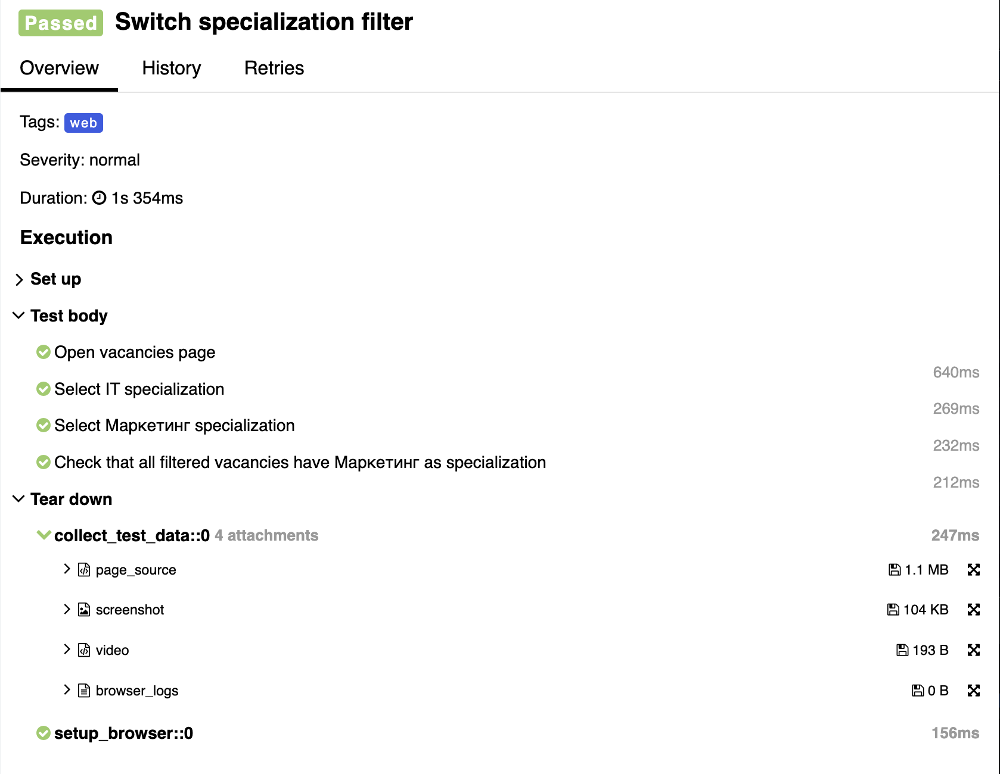
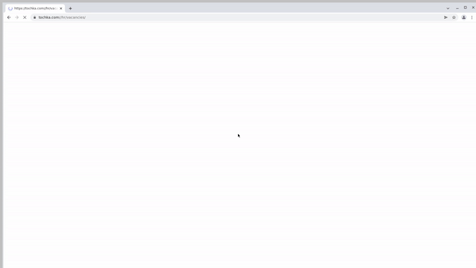
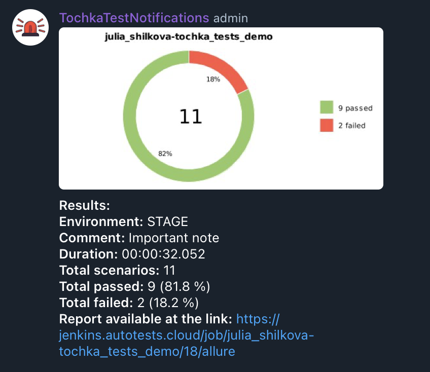
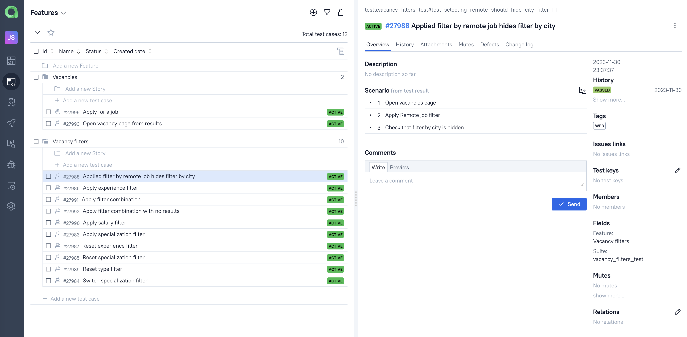
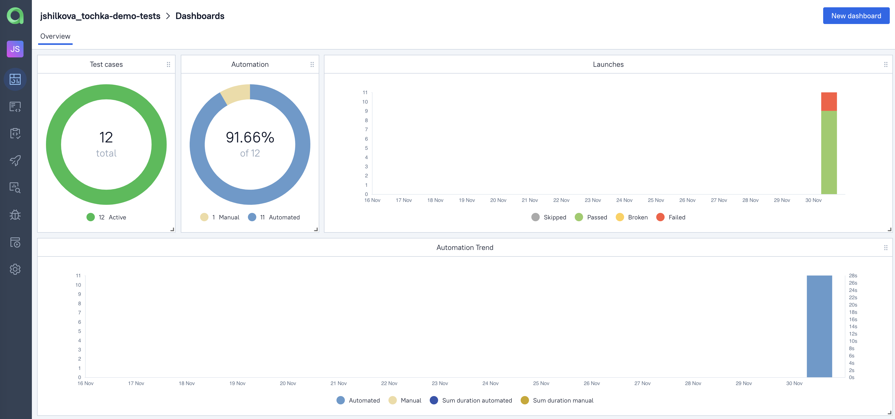

# Проект тестирования сайта банка Точка</h1>

Проект демонстрирует организацию с нуля удобной инфраструктуры для внедрения автоматизации. 
С помощью Pytest и Selene реализована основа для добавления новых тестов, запуск тестов происходит в Jenkins,
отчёты о прохождении загружаются в Allure TestOpts, 
в Telegram приходят нотификации с результатами прогона.

Тестами покрыта форма поиска [открытых вакансий.](https://tochka.com/hr/vacancies/) 
Набор тестов не является полным, но тем не менее он разумный)

---

### Автотестами проверяется:

* [X]  Применение, изменение и сброс фильтра про направлению работы
* [X]  Применение и сброс фильтра по опыту работы
* [X]  Скрытие фильтра про городу при выборе удаленного формата работы
* [X]  Сброс фильтра по формату работы
* [X]  Применение фильтра про зарплате
* [X]  Применение комбинации из трех фильтров с нужной вакансией в результате
* [X]  Применение комбинации фильтров, которая дает пустую выдачу
* [X]  Переход на страницу вакансии из результатов поиска

---

### Технологии:

<table border="2">
  <tbody>
    <tr>
        <td>Python</td>
        <td>Pytest</td>
        <td>Selene</td>
        <td>Selenium</td>
        <td>Selenoid</td>
        <td>Jenkins</td>
        <td>Allure Reports</td>
        <td>Allure TestOps</td>
        <td>Telegram</td>
    </tr>
    <tr>
        <td></td>
        <td></td>
        <td></td>
        <td></td>
        <td></td>
        <td></td>
        <td></td>
        <td></td>
        <td></td>
    </tr>
  </tbody>
</table>

---

### Запуск автотестов выполняется на сервере [Jenkins](https://jenkins.autotests.cloud/job/julia_shilkova-tochka_tests_demo/)

#### Параметры сборки

* `environment` - окружение для запуска тестов
* `comment` - комментарий к запуску, будет указан в нотификации в Telegram

#### Чтобы запустить автотесты в Jenkins:

1. Открыть [проект](https://jenkins.autotests.cloud/job/julia_shilkova-tochka_tests_demo/)
2. Выбрать пункт `Build with Parameters`
3. Выбрать окружение в выпадающем списке
4. Добавить комментарий
5. Нажать кнопку `Build`
6. Результат запуска сборки можно посмотреть в отчёте Allure

#### Чтобы запустить локально:

1. Задать логин и пароль от учетной записи **selenoid.autotests.cloud** 
в переменных окружения `LOGIN` и `PASSWORD`
2. Импортировать зависимости `pip install -r requirements.txt`
3. Запустить тесты `pytest .`
4. Сформировать allure отчет `allure serve`

### Allure отчёт

#### Общие результаты

#### Список тест кейсов

#### Пример подробного отчета о прохождении теста
Для каждого теста помимо шагов добалены скриншот, код страницы, видео прохождения и логи браузера,
чтобы легче находить причину, по которой упал тест.  

### Видео прохождения тестов

###  Telegram бот
Результаты прохождения тестов приходят в чат в Telegram: так ответственные могут быстро узнавать о проблемах. 
В кратком отчете есть процент упавших тестов и ссылка на страницу с подробным allure отчетом.

### Allure TestOps

Интегрировала проект с TestOps. Здесь можно посмотреть тест кейсы по фичам

а также общие результаты тестирования и долю автоматизированных кейсов

